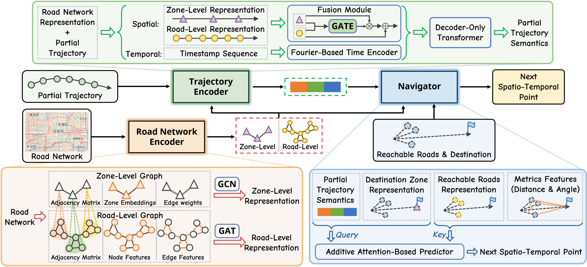

## <div align="center"> Holistic Semantic Representation for Navigational Trajectory Generation </div>

<div align="center">

  <a href="https://arxiv.org/abs/2501.02737"></a> &ensp;
  <a href="https://huggingface.co/datasets/caoji2001/HOSER-dataset/tree/main"></a> &ensp;

</div>

This is the official implementation of paper "Holistic Semantic Representation for Navigational Trajectory Generation" [[arXiv](https://arxiv.org/abs/2501.02737)].

⭐⭐ If you find this repository helpful, please kindly leave a star here 😊.

### Framework Overview



HOSER predicts the next spatio-temporal point based on the current state and generates the trajectory between the given OD pair through a search-based method. As illustrated above, HOSER first employs a Road Network Encoder to model the road network at different levels. Based on the road network representation, a Multi-Granularity Trajectory Encoder is proposed to extract the semantic information from the current partial trajectory. To better incorporate prior knowledge of human mobility, a Destination-Oriented Navigator is used to seamlessly integrate the current partial trajectory semantics with the destination guidance.

### Requirements

The required packages with Python environment is:
```
torch
torch_geometric
tqdm
PyYAML
numpy
pandas
sklearn
shapely
tensorboard
haversine
loguru
```

### Running

* Data Preprocessing
  
  First, download the required dataset from [Hugging Face](https://huggingface.co/datasets/caoji2001/HOSER-dataset/tree/main) and place it in the `data` folder.

  Next, We use [KaHIP](https://github.com/KaHIP/KaHIP), a graph partitioning framework, to partition the road network. Install KaHIP by running the following commands in your terminal:

  ```console
  git clone --branch v3.17 https://github.com/KaHIP/KaHIP.git
  cd KaHIP
  mkdir build
  cd build 
  cmake ../ -DCMAKE_BUILD_TYPE=Release     
  make
  cd ../..
  ```

  Finally, run our script to preprocess the data:

  ```console
  cd data/preprocess
  python partition_road_network.py
  python get_zone_trans_mat.py
  cd ../..
  ```

* Model Training

  `python train.py`
  * `--dataset` specifies the dataset, such as `Beijing`, `Porto`, or `San Francisco`
  * `--seed` specifies the random seed
  * `--cuda` specifies the GPU device number

* Trajectory Generation

  `python gene.py`
  * `--dataset` specifies the dataset, such as `Beijing`, `Porto`, or `San Francisco`
  * `--seed` specifies the random seed
  * `--cuda` specifies the GPU device number
  * `--num_gene` specifies the number of trajectories to generate
  * `--processes` specifies the number of processes to use when generating trajectories in parallel

### Citation
  If our work contributes to your research, please consider citing it:

  ```
  @inproceedings{cao2025hoser,
    title={Holistic Semantic Representation for Navigational Trajectory Generation},
    author={Cao, Ji and Zheng, Tongya and Guo, Qinghong and Wang, Yu and Dai, Junshu and Liu, Shunyu and Yang, Jie and Song, Jie and Song, Mingli},
    booktitle={AAAI Conference on Artificial Intelligence (AAAI)},
    year={2025},
  }
  ```

### Acknowledgments

This work is supported by the Zhejiang Province "JianBingLingYan+X" Research and Development Plan (2024C01114), Zhejiang Province High-Level Talents Special Support Program "Leading Talent of Technological Innovation of Ten-Thousands Talents Program" (No.2022R52046), the Fundamental Research Funds for the Central Universities (No.226-2024-00058), and the Scientific Research Fund of Zhejiang Provincial Education Department (Grant No.Y202457035). Also, we thank Bayou Tech (Hong Kong) Limited for providing the data used in this paper free of charge.

### Contact

If you have any question, please feel free to contact

Ji Cao, [caoji2001@zju.edu.cn](mailto:caoji2001@zju.edu.cn).
